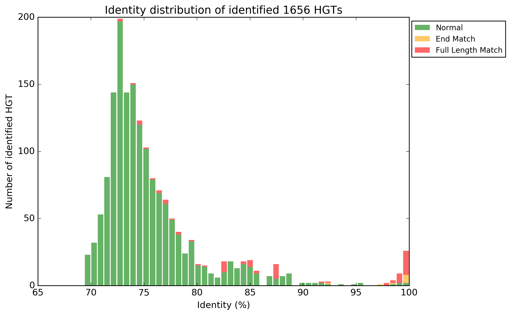
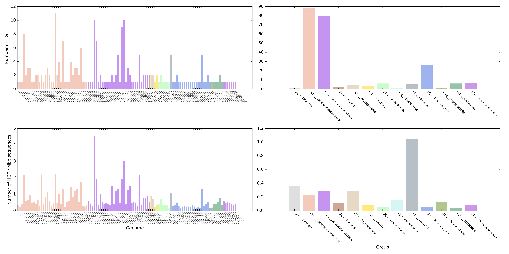

Publication
---

+ **Song WZ**, Wemheuer B, Zhang S, Steensen K, Thomas T* (2018) MetaCHIP: community-level horizontal gene transfer identification through the combination of best-match and explicit phylogenetic tree approaches. Microbiome **(Under review)** [PDF](https://songweizhi.github.io/assets/pdfs/Publication_2018_MetaCHIP_manuscript.pdf) 
+ Contact: Weizhi Song (songwz03@gmail.com), Torsten Thomas (t.thomas@unsw.edu.au)
+ Affiliation: The Centre for Marine Bio-Innovation (CMB), The University of New South Wales, Sydney, Australia

Dependencies:
---

### Python libraries
* [BioPython](https://github.com/biopython/biopython.github.io/): Python tools for computational molecular biology.
* [Numpy](http://www.numpy.org): fundamental package for scientific computing with Python.
* [SciPy](https://www.scipy.org): Python-based ecosystem for mathematics, science, and engineering.
* [Matplotlib](http://matplotlib.org): Python plotting library.
* [ETE3](http://etetoolkit.org): environment for tree exploration in Python.

### R packages
* [optparse](https://cran.r-project.org/web/packages/optparse/index.html): command line option parser in R.
* [ape](https://cran.r-project.org/web/packages/ape/index.html): package for analyses of phylogenetics and evolution in R.
* [circlize](https://cran.r-project.org/web/packages/circlize/index.html): package for circular visualization.

### Third-party software
MetaCHIP makes use of the following 3rd party dependencies and assumes these are on your system path. Specify full path 
to their executables in the config file if they are not on the system path.  
* [Prodigal](https://github.com/hyattpd/Prodigal): protein-coding gene prediction tool for prokaryotic genomes.
* [HMMER](http://hmmer.org): tool for biosequence analysis using profile hidden Markov models.
* [MAFFT](https://mafft.cbrc.jp/alignment/software/): multiple sequences alignment program.
* [FastTree](http://www.microbesonline.org/fasttree/): tool for inferring phylogenies from alignments .
* [BLAST+](https://blast.ncbi.nlm.nih.gov/Blast.cgi?PAGE_TYPE=BlastDocs&DOC_TYPE=Download): you know what it is!
* [Ranger-DTL 2.0](https://compbio.engr.uconn.edu/software/RANGER-DTL/): software for inferring gene family evolution.

How to install:
---

1. MetaCHIP can be installed with pip after you have its 3rd party dependencies and R packages installed on your system. 
Python libraries required by MetaCHIP will be installed automatically during the pip installation:

        pip install MetaCHIP
        
1. You can either add MetaCHIP's dependencies to your system path or specify full path to their executables in MetaCHIP_config.py, which is in folder lib/site-packages/MetaCHIP.

How to run:
---

1. A detailed manual can be found at [manual/MetaCHIP_User_Manual_v1.0.1.pdf](https://github.com/songweizhi/MetaCHIP/blob/master/manual/MetaCHIP_User_Manual_v1.0.1.pdf).

1. The input files for MetaCHIP include a folder holds the sequence file of all query genome bins [[example](https://github.com/songweizhi/MetaCHIP/blob/master/example_dataset/human_gut_bins)], 
as well as a text file which holds taxonomic classification results of all input genomes [[example](https://github.com/songweizhi/MetaCHIP/blob/master/example_dataset/human_gut_bins_GTDB.tsv)].

1. [GTDB-Tk](https://github.com/Ecogenomics/GTDBTk) is recommended for taxonomic classification of input genomes.

1. Output format for BLASTN in the PI and BM steps: 
        
        -outfmt "6 qseqid sseqid pident length mismatch gapopen qstart qend sstart send evalue bitscore qlen slen"

1. Some examples: 

        # show help information
        MetaCHIP -h
        MetaCHIP PI -h
        MetaCHIP BM -h
        MetaCHIP PG -h
        
        # run MetaCHIP by grouping input genomes at Class level according to their taxonomic classifications
        MetaCHIP PI -i bin_folder -x fasta -taxon NorthSea_GTDB_output.tsv -r c -p NorthSea -t 6
        MetaCHIP BM -p NorthSea -r c -t 6
        MetaCHIP PG -p NorthSea -r c -t 6

        # run MetaCHIP with customized grouping profile
        MetaCHIP PI -i bin_folder -x fasta -g customized_grouping.txt -p NorthSea -t 6
        MetaCHIP BM -p NorthSea -g customized_grouping.txt -t 6
        MetaCHIP PG -p NorthSea -g customized_grouping.txt -t 6
        
        # Detect HGT with MetaCHIP at multiple levels (e.g. class and order)
        MetaCHIP PI -i bin_folder -x fasta -taxon NorthSea_GTDB_output.tsv -r c -p NorthSea -t 6
        MetaCHIP PI -i bin_folder -x fasta -taxon NorthSea_GTDB_output.tsv -r o -p NorthSea -t 6 -grouping_only
        MetaCHIP BM -p NorthSea -r c -t 6
        MetaCHIP BM -p NorthSea -r o -t 6
        MetaCHIP PG -p NorthSea -r c -t 6
        MetaCHIP PG -p NorthSea -r o -t 6

Output files:
---

1. Identified HGT candidates and their sequences. See some example of contig end_match and full_length_match below. 

    |Gene_1|Gene_2|Gene_1_group|Gene_2_group|Identity|end_match|full_length_match|Direction|
    |---|---|---|---|---|---|---|---|
    |AAM_03063|BAD_01456|A|B|100.0|no|no|AAM<-BAD|
    |AMAU_05759|BHS_02873|A|B|79.02|yes|no|AMAU<-BHS|
    |BAD_00475|AAM_01658|B|A|74.354|no|no|BAD<-AAM|
    |BDS_01877|AMAC_00215|B|A|100.0|no|yes|BDS<-AMAC|
    |BGC_01656|AKV_01272|B|A|100.0|no|no|BGC<-AKV|
    |BNM_00983|AMAC_00159|B|A|75.269|no|no|BNM<-AMAC|
    |BNM_02093|AMS_03378|B|A|100.0|yes|no|BNM<-AMS|
    |BNM_02445|AMS_01681|B|A|77.961|no|yes|BNM<-AMS|
    |BNM_02717|AAM_02737|B|A|74.47|no|no|BNM<-AAM|

1. Flanking regions of identified HGT candidates.
    
        
1. Gene flow between groups.
    
    
1. Identity distribution of identified HGTs.
    

1. The number of identified HGT in each genome/group.
    
 
1. Examples of contig end match.
       
    
        
1. Examples of contig full length match
    
    
    